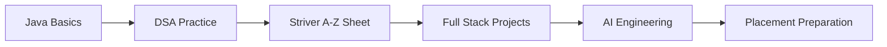

<h2 align="center">Hi there Hi there, 👋 I'm Atharv Navatre</h2>

  
   

💻 BTech CSE Student — AGPIT Solapur  
🤖 Full Stack Developer | Open-Source Contributor | AI Engineer 

---

## 🎯 Professional Summary

Computer Science Engineering student focused on building strong fundamentals in **Full Stack Development, Data Structures & Algorithms (Java), and Artificial Intelligence**.

Currently undergoing **Professional Training in AIML**, contributing to open source, and building projects step-by-step while preparing for placements.

Key Interests & Direction:

🔹 AI/ML & Generative AI Engineering  
🔹 Backend Development & Scalable Web Systems  
🔹 Open Source Collaboration  
🔹 Problem Solving & Placement Preparation  
🔹 Future Deep Dive into Docker, Linux, Networks, Robotics & Security

---

## 🔥 Current Focus

- 🤝 Open Source Contributor — **LLM4S Organization** (Top Contributor Ranking)
- 🤖 Professional Training — Apna College Prime AIML Batch
- 🧠 Java DSA Practice — Pratyush Sheet + Striver A-Z Roadmap
- 🚀 Developing AI + Web Projects
- 🏆 Weekly Learning & Skill Improvement Workflow

---

## 📊 By The Numbers

| Metric | Details |
|---|---|
| ☁️ Cloud Learning | Google Cloud Skills Boost Labs Completed |
| 🤝 Open Source | 5+ Pull Requests • Top 10 Leaderboard |
| 🏆 Hackathons | AGTechHackathon Participant |
| 🎓 Education | Diploma Distinction (84.17%) |
| 📚 Learning Path | AIML Professional Training |

---

## 🎓 Education

**Bachelor of Technology — Computer Science Engineering**  
AGPIT Solapur • Expected 2026 • SGPA ~7  

**Diploma in Computer Engineering**  
Vidya Vikas Prathishan, Solapur • 2024 • 84.17%

**10th Grade — Shri Mallikarjun Highschool**  
Completed 2021 • 84.80%

---

## 🛠️ Technical Skills

### 🌐 Web Development
HTML • CSS • JavaScript • React • Node.js • Express • Tailwind

### 🧠 DSA & Programming
Java • Problem Solving • Pattern Practice • Logic Building

### 🤖 AI / ML Engineering (Learning Phase)
Python • Machine Learning • Deep Learning Basics • GenAI Concepts

### 📊 Aptitude
Logical Reasoning • Quantitative Practice

### 🚧 Future Advanced Skills (Interested)
Docker • Linux Systems • Networking • Cybersecurity Basics  
Advanced AI Systems • Robotics Exploration • Blockchain

---

## 🤝 Open Source — LLM4S

Role: **Contributor**

- 🔗 Repo — https://github.com/Atharv-navatre/llm4s
- 🏆 Leaderboard — https://llm4sroadmap.netlify.app/
- ✅ PR Event — https://github.com/llm4s/llm4s/issues/613#event-22778191690

---

## 🚀 Projects

### 🔎 Price Tracker
🌐 https://pricetracker-one.vercel.app/  
Diploma Final Year Project for tracking product pricing.

### 🤖 LearnMate-AI 
AI tool generating MCQs/questions from user topics.

Upcoming:
- AI Projects from AIML Training
- Full Stack Projects

---

## 📚 Learning Workflow

Resources:

- Pratyush Sheet  
https://docs.google.com/spreadsheets/d/1T5-nGsJ9WNwna44e9WWRD0jlZIT5KxVOGvylcvvVrY8

- DSA Playlist  
https://youtube.com/playlist?list=PLbJhGqY-mq47k_WLUtzVjmarUm1EuXPj2

---

## 🏆 Achievements & Participation

- ☁️ Google Cloud Skills Boost — Labs Completed  
- 🧑‍💻 AGTechHackathon — National Level Participation  
- 🌐 Web Development Competition — AGPIT  
- 🤝 Code Club — Support Team Member  
- 🎓 Technical Sessions — AI/ML, Cloud, Web

Credly Badges:  
https://www.credly.com/users/atharv-navatre/badges

---

## 🔗 Developer Profiles

GitHub — https://github.com/Atharv-navatre  
LinkedIn — https://www.linkedin.com/in/atharv-navatre-1201662b1/  
LeetCode — https://leetcode.com/u/bzSkWkHAlg/  
Google Cloud — https://www.skills.google/public_profiles/b4c90fcc-44cb-465d-b019-766dcb0c5933

---

## 📊 GitHub Stats

---

  

⭐ Always growing through learning, open source, and building real-world solutions step by step.
---

## 📬 Contact & Info

📍 Location: Solapur, Maharashtra, India  
🌐 Website: Coming Soon  
📧 Email: atharvnavatre183@gmail.com  
📱 Phone: +91-9175025574

---

